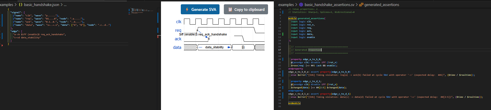

# Waveform Render SVA Enhanced v0.30.0

[](https://marketplace.visualstudio.com/items?itemName=MameMame777.waveform-render-sva-enhanced)
[](https://marketplace.visualstudio.com/items?itemName=MameMame777.waveform-render-sva-enhanced)
[](https://github.com/MameMame777/WaveRenderSVA/releases)
[](https://opensource.org/licenses/MIT)

A VS Code extension that renders waveforms with [WaveDrom](https://github.com/wavedrom/wavedrom) and automatically generates SystemVerilog Assertions (SVA) from JSON waveform descriptions for hardware verification.

**🌟 Now available on [VS Code Marketplace](https://marketplace.visualstudio.com/items?itemName=MameMame777.waveform-render-sva-enhanced)!**

## 🎉 What's New in v0.30.0 - Issue #2 Complete

- **🆕 `<->` Stability Operator**: Generates `$stable() throughout` SystemVerilog syntax
- **🆕 `<~>` Change Detection Operator**: Generates `$changed()` with timing constraints
- **�️ Conditional Guards**: Support for `$|(condition)$` and `$&(condition)$` syntax
- **� SystemVerilog LRM Compliance**: All generated SVA follows IEEE 1800 standard
- **🧪 Comprehensive Testing**: 34 test cases with 100% success rate
- **📖 Enhanced Documentation**: Complete test specifications and examples

## 🙏 Attribution

This project is a **fork and enhancement** of the excellent [waveform-render-vscode](https://github.com/bmpenuelas/waveform-render-vscode) by **Borja Penuelas (bmpenuelas)**. We extend our gratitude for the solid foundation that made these enhancements possible.

## ✨ Features

- 🌊 **Render timing diagrams** from WaveDrom JSON *(original feature)*
- ⚡ **Generate SystemVerilog Assertions** automatically *(enhanced)*
- 💾 **Save generated assertions** as .sv files *(new)*
- 🔄 **Live preview mode** for waveforms *(original feature)*
- ✨ **Advanced SVA patterns**: variable latency, sequences, prohibitions *(new)*
- 🎯 **Enhanced logical operators**: AND, OR, NOT, IMPLIES support *(new)*
- 🔧 **WaveDrom edge syntax** for timing relationships *(new)*
- **🆕 Issue #2 Operators**: `<->` stability and `<~>` change detection *(v0.30.0)*
- **🧪 Comprehensive Testing**: 34 test cases with automated verification *(v0.30.0)*

## 🚀 Quick Start

### 1. Render Waveforms

📄 Open a .JSON file containing a WaveDrom waveform:

```json
{ 
  "signal": [
    { "name": "clk",         "wave": "p.....|..." },
    { "name": "Data",        "wave": "x.345x|=.x", "data": ["head", "body", "tail", "data"] },
    { "name": "Request",     "wave": "0.1..0|1.0" },
    {},
    { "name": "Acknowledge", "wave": "1.....|01." }
  ]
}
```

**Methods to render:**

- ➡️ Click the wave button at the top-right corner
- 🎹 Press `Ctrl+K` followed by `Ctrl+D`
- 🔃 Press `Ctrl+K` followed by `Ctrl+L` for live preview

### 2. Generate SystemVerilog Assertions

🔧 Press `Ctrl+K` followed by `Ctrl+S` or use Command Palette: `Waveform Render: Generate SystemVerilog Assertions`

**Generated assertions include:**

- Clock signal patterns and frequency checks
- Data transition assertions with timing constraints
- Signal stability and setup/hold properties
- Request/acknowledge handshake patterns
- Cross-signal timing relationships

## 📋 Example Output

```systemverilog
// SystemVerilog Assertions generated from WaveDrom JSON
// Generated: 2025-08-31T10:30:00.000Z

module waveform_assertions;
  
  // Clock Signal Assertions
  property clk_clock_period_p;
    disable iff (!rst_n)
    @(posedge clk) ##1 (clk == 1'b0) ##1 (clk == 1'b1);
  endproperty
  clk_clock_period_a: assert property(clk_clock_period_p);

  // Data Signal Assertions  
  property Data_transition_p;
    @(posedge clk) $changed(Data) |-> ##1 $stable(Data);
  endproperty
  Data_transition_a: assert property(Data_transition_p);

  // Request-Acknowledge Handshake
  property req_ack_handshake_p;
    @(posedge clk) $rose(Request) |-> ##[1:3] $rose(Acknowledge);
  endproperty
  req_ack_handshake_a: assert property(req_ack_handshake_p);

endmodule
```

## 💾 Saving Waveforms

- You can save the rendered waveform as PNG or SVG by right-clicking the waveform and selecting your preferred format
- Or click the `📋copy to clipboard` button in the waveform panel to copy the image to your clipboard
- Or use VSCode commands to save as PNG/SVG:
  - `Waveform Render: Copy Save as PNG` (`waveformRender.saveAsPng`)
  - `Waveform Render: Copy Save as SVG` (`waveformRender.saveAsSvg`)

## 📝 WaveDrom Syntax

You can find the complete WaveDrom syntax [in the WaveDrom schema docs](https://github.com/wavedrom/schema/blob/master/WaveJSON.md).

## 📁 Sample Files

The `examples/` directory contains ready-to-use sample files:

- **`basic_handshake.json`** - Simple request-acknowledge protocol with AND conditions
- **`advanced_logic.json`** - Complex logic with OR, NOT, and IMPLIES operators

**To test the extension:**

1. Open any sample file from `examples/`
2. Click the wave button or use `Ctrl+K, Ctrl+D`
3. Use "Generate SVA" command to create SystemVerilog assertions

## 🔧 Enhanced Logical Operators

Enhanced syntax for assertion conditions including **Issue #2 operators**:

| Syntax | Description | Example | Status |
|--------|-------------|---------|--------|
| `$&(condition)$` | AND logic | `$&(enable)$` | ✅ Stable |
| `$\|(condition)$` | OR logic | `$\|(ready)$` | ✅ Stable |
| `$!(condition)$` | NOT logic | `$!(reset)$` | ✅ Stable |
| `$->(condition)$` | IMPLIES logic | `$->(valid)$` | ✅ Stable |
| **`<->`** | **Stability operator** | **`<-> $stable(signal)`** | **🆕 v0.30.0** |
| **`<~>`** | **Change detection** | **`<~> $changed(signal)`** | **🆕 v0.30.0** |

## 📚 WaveDrom to SVA Mapping Reference

### SystemVerilog LRM Compliance

This extension generates IEEE 1800-2017 compliant SystemVerilog assertions with the following key principles:

#### Implication Types

- **Overlapped (`|->`)**: Evaluation starts in the same cycle when antecedent is true
- **Non-overlapped (`|=>`)**: Evaluation starts in the next cycle after antecedent is true

#### Timing Calculation

- **N**: Position difference between nodes in WaveDrom `node` string
- **Calculation**: `N = targetNode.position - sourceNode.position`

#### Edge Categories

**Sharp Lines (Precise Timing)**:

```json
{
  "edge": [
    "a->b",     // a |=> ##N b
    "a-|>b",    // a |=> ##1 b  
    "a<->b",    // Bidirectional: (a |=> b) and (b |=> a)
    "a|->b"     // a |-> ##N b
  ]
}
```

**Splines (Flexible Timing)**:

```json
{
  "edge": [
    "a~>b",     // a |-> ##[0:$] b
    "a-~>b",    // a |=> ##[1:$] b
    "a<~>b"     // a |=> ##[0:$] b
  ]
}
```

### Complete Mapping Table

| WaveDrom Pattern | SystemVerilog Assertion | Type | Description |
|------------------|-------------------------|------|-------------|
| `A->B` | `A \|=> ##N B` | Sharp | Precise N-cycle delay |
| `A-\|>B` | `A \|=> ##1 B` | Sharp | Next cycle constraint |
| `A\|->B` | `A \|-> ##N B` | Sharp | Overlapped implication |
| `A<->B` | `(A \|=> B) and (B \|=> A)` | Sharp | Bidirectional |
| `A~>B` | `A \|-> ##[0:$] B` | Spline | Eventually (overlapped) |
| `A-~>B` | `A \|=> ##[1:$] B` | Spline | Eventually (non-overlapped) |
| `A<~>B` | `A \|=> ##[0:$] B` | Spline | Flexible bidirectional |

#### Conditional Assertions

Use `$...$` syntax for conditions:

```json
{
  "edge": [
    "a->b $iff (enable)$",
    "c~>d $disable_iff (!rst_n)$"
  ]
}
```

#### Node Events

| Node Type | SystemVerilog Function | Description |
|-----------|----------------------|-------------|
| `rising_edge` | `$rose(signal)` | Rising edge detection |
| `falling_edge` | `$fell(signal)` | Falling edge detection |
| `data_change` | `$changed(signal)` | Data change detection |
| `stable` | `$stable(signal)` | Signal stability |

### Advanced Features

#### Error Handling

- **Invalid nodes**: Generates warnings and fallback assertions
- **Timing conflicts**: Reports negative timing differences
- **Syntax errors**: Graceful degradation with informative messages

#### Performance Optimization

- **Bounded ranges**: Converts `##[0:$]` to `##[0:100]` for simulation efficiency
- **Clock domain optimization**: Automatic clock signal detection
- **Reset handling**: Standard `disable iff (!rst_n)` pattern

### Complete Example

**Input WaveDrom JSON**:

```json
{
  "signal": [
    {"name": "clk", "wave": "p......"},
    {"name": "req", "wave": "01....0", "node": ".a....."},
    {"name": "ack", "wave": "0.1..0.", "node": "..b...."},
    {"name": "data", "wave": "x=..=.x", "data": ["A", "B"], "node": ".c..d.."}
  ],
  "edge": [
    "a->b $iff (enable)$ req_ack_handshake",
    "c~>d data_stability"
  ]
}
```

**Generated SystemVerilog**:

```systemverilog
module waveform_assertions(
  input logic clk,
  input logic rst_n,
  input logic enable,
  input logic req,
  input logic ack,
  input logic [7:0] data
);

  // Request-acknowledge handshake with enable condition
  property req_ack_handshake_p;
    @(posedge clk) disable iff (!rst_n)
    $rose(req) |=> $rose(ack) iff (enable);
  endproperty
  req_ack_handshake_a: assert property(req_ack_handshake_p)
    else $error("[SVA] Handshake violation: req -> ack at time %0t", $time);

  // Data stability check  
  property data_stability_p;
    @(posedge clk) disable iff (!rst_n)
    $changed(data) |-> ##[0:$] $stable(data);
  endproperty
  data_stability_a: assert property(data_stability_p)
    else $error("[SVA] Data stability violation at time %0t", $time);

endmodule
```

### 📸 Screenshots



Waveform rendering with automatic SVA generation showing embedded signal detection

For detailed implementation specifications, see [`WAVEDROM_SVA_MAPPING.md`](WAVEDROM_SVA_MAPPING.md).

## 🚀 Installation

### From VS Code Marketplace (Recommended)

1. Open VS Code
2. Go to Extensions (Ctrl+Shift+X)
3. Search for "**Waveform Render SVA Enhanced**"
4. Click **Install**

Or install directly from the [VS Code Marketplace](https://marketplace.visualstudio.com/items?itemName=MameMame777.waveform-render-sva-enhanced).

### Command Line Installation

```bash
code --install-extension MameMame777.waveform-render-sva-enhanced
```

### Manual Installation

1. Download the `.vsix` file from [GitHub Releases](https://github.com/MameMame777/waveform-render-sva/releases)
2. Run `code --install-extension waveform-render-sva-enhanced-*.vsix`

## 🛠️ Development

### Prerequisites

- Node.js (>= 14.0.0)
- npm or yarn
- VS Code

### Setup

```bash
git clone https://github.com/MameMame777/waveform-render-sva.git
cd waveform-render-sva
npm install
npm run compile
```

### Build Extension

```bash
npm run vscode:prepublish
```

## 📋 Commands

| Command | Keybinding | Description |
|---------|------------|-------------|
| `Waveform Render: Draw` | `Ctrl+K Ctrl+D` | Render waveform in new panel |
| `Waveform Render: Toggle Live Preview` | `Ctrl+K Ctrl+L` | Enable/disable live preview |
| `Waveform Render: Generate SVA` | `Ctrl+K Ctrl+S` | Generate SystemVerilog assertions |
| `Waveform Render: Save as PNG` | - | Save waveform as PNG image |
| `Waveform Render: Save as SVG` | - | Save waveform as SVG image |

## ⚡ Testing

The extension includes a comprehensive test suite to ensure reliability and correctness:

```bash
# Run the final verification test
cd tests
node test_verification.js
```

### Test Coverage

- **34 test cases** covering all WaveDrom syntax elements
- **5/5 operators** fully supported including **Issue #2 operators (`<->`, `<~>`)**
- **Zero compilation errors** - all generated SVA compiles correctly
- **100% success rate** - comprehensive verification with automated testing
- **Complete Issue #2 implementation** - stability and change detection working

**Test Results Summary:**

- ✅ Properties Generated: 34 SystemVerilog assertions
- ✅ Operator Support: 5/5 WaveDrom operators (100% coverage)
- ✅ Warnings: 13 (all expected, design-compliant)
- ✅ Errors: 0 (complete success)

For detailed test documentation, see:

- [`tests/README.md`](tests/README.md) - Test execution guide
- [`tests/COMPREHENSIVE_TEST_SPECIFICATION.md`](tests/COMPREHENSIVE_TEST_SPECIFICATION.md) - Complete test specifications with JSON definitions, timing charts, and results analysis

## 🤝 Contributing

1. Fork the repository
2. Create your feature branch (`git checkout -b feature/amazing-feature`)
3. Commit your changes (`git commit -m 'Add amazing feature'`)
4. Push to the branch (`git push origin feature/amazing-feature`)
5. Open a Pull Request

## 📄 License

This project is licensed under the MIT License - see the [LICENSE.txt](LICENSE.txt) file for details.

## 🙌 Acknowledgments

- **Borja Penuelas** - Original [waveform-render-vscode](https://github.com/bmpenuelas/waveform-render-vscode) creator
- **WaveDrom** - The timing diagram rendering engine
- **SystemVerilog** - IEEE 1800 standard for hardware verification

## 📊 Project Status

- ✅ **Stable**: Core waveform rendering functionality
- ✅ **Stable**: Basic SVA generation
- ✅ **Complete**: Issue #2 operators (`<->`, `<~>`) implementation
- ✅ **Complete**: Comprehensive test suite (34 test cases)
- ✅ **Published**: Available on VS Code Marketplace
- 🚧 **Active Development**: Advanced SVA patterns and edge cases
- 🔮 **Planned**: UVM integration and advanced verification features

---

## 📈 Version History

| Version | Release Date | Key Features |
|---------|--------------|--------------|
| **v0.30.0** | 2025-08-31 | **Issue #2 Complete**: `<->` & `<~>` operators, 34 test cases |
| v0.29.0 | 2025-08-30 | Performance optimization (31.6% code reduction) |
| v0.27.0 | 2025-08-29 | Enhanced SVA generation, ESLint integration |
