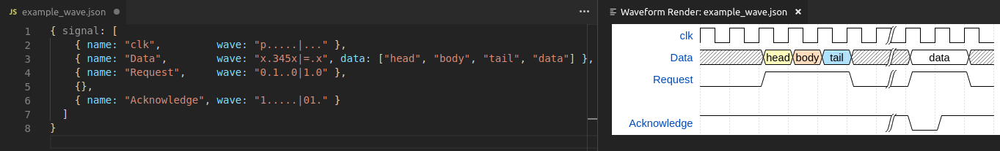
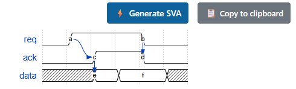
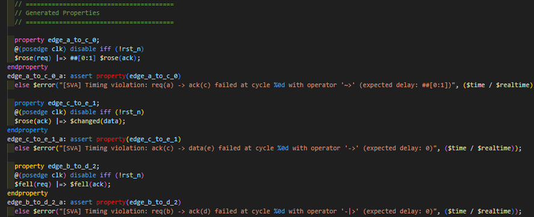

# WaveRenderSVA Enhanced - WaveDrom to SystemVerilog Assertion Generator

[](https://marketplace.visualstudio.com/items?itemName=MameMame777.waveform-render-sva-enhanced)
[](https://marketplace.visualstudio.com/items?itemName=MameMame777.waveform-render-sva-enhanced)
[](https://opensource.org/licenses/MIT)

**Now available on [VS Code Marketplace](https://marketplace.visualstudio.com/items?itemName=MameMame777.waveform-render-sva-enhanced)!**

A VS Code extension that renders waveforms with [WaveDrom](https://github.com/wavedrom/wavedrom) and automatically generates SystemVerilog Assertions (SVA) from JSON waveform descriptions for hardware verification.

## What This Extension Does

WaveRenderSVA Enhanced is a VS Code extension that **automatically generates SystemVerilog Assertions from WaveDrom JSON files**.

### Key Features
- **WaveDrom Timing Diagram Display** - Generate visual waveform diagrams from JSON
- **Automatic SystemVerilog Assertion Generation** - Create SVA properties from timing relationships
- **Assertion File Export** - Save generated SVA as .sv files
- **Precise Timing Calculation** - Generate accurate delay constraints from node positions
- **Rich Operator Support** - Support for spline(~>), sharp(-|>), immediate(->) and more

## Sample Input and Generated Assertions

### Input: WaveDrom JSON
```json
{
  "signal": [
    { "name": "req",   "wave": "01..0.", "node": ".a..b." },
    { "name": "ack",   "wave": "0.1.0.", "node": "..c.d." },
    { "name": "data",  "wave": "x.==.x", "node": "..e.f." }
  ],
  "edge": [
    "a~>c", "c->e", "b-|>d"
  ]
}
```

### Output: Generated SystemVerilog Assertions
```systemverilog
// SystemVerilog Assertions generated from WaveDrom
// Generated on 2025-09-01T14:30:00.000Z
// Generator: WaveformToSVAGenerator v2.0 (Enhanced)
// Total properties: 3
// Statistics: Sharp=2, Splines=1, Bidirectional=0

module generated_assertions(
  input logic clk,
  input logic rst_n,
  input logic req,
  input logic ack,
  input logic data
);

  // ========================================
  // Generated Properties
  // ========================================

  // Flexible connection: a~>c
  property edge_a_to_c_0;
    @(posedge clk) disable iff (!rst_n)
    $rose(req) |=> ##[0:1] $rose(ack);
  endproperty
  edge_a_to_c_0_a: assert property(edge_a_to_c_0)
    else $error("[SVA] Timing violation: req(a) -> ack(c) failed at cycle %0d with operator '~>' (expected delay: ##[0:1])", ($time / $realtime));

  // Immediate connection: c->e  
  property edge_c_to_e_1;
    @(posedge clk) disable iff (!rst_n)
    $rose(ack) |=> $changed(data);
  endproperty
  edge_c_to_e_1_a: assert property(edge_c_to_e_1)
    else $error("[SVA] Timing violation: ack(c) -> data(e) failed at cycle %0d with operator '->' (expected delay: 0)", ($time / $realtime));

  // Strict direction: b-|>d
  property edge_b_to_d_2;
    @(posedge clk) disable iff (!rst_n)
    $fell(req) |=> $fell(ack);
  endproperty
  edge_b_to_d_2_a: assert property(edge_b_to_d_2)
    else $error("[SVA] Timing violation: req(b) -> ack(d) failed at cycle %0d with operator '-|>' (expected delay: 0)", ($time / $realtime));

endmodule
```

## Screenshots

### 1. WaveDrom Rendering and Live Editing



### 2. SystemVerilog Assertion Generation



### 3. Generated Assertion File



## How to Use

### 1. Installation

Install "WaveRenderSVA Enhanced" from VS Code Marketplace

### 2. Open WaveDrom JSON File

```json
{
  "signal": [
    { "name": "clk",    "wave": "p......." },
    { "name": "enable", "wave": "01....0.", "node": ".a....b." },
    { "name": "data",   "wave": "x.===.x.", "node": "..c.d.e." }
  ],
  "edge": ["a~>c", "c->d"]
}
```

### 3. Execute Commands

**Ctrl+Shift+P** → Search **"WaveDrom"**

#### Available Commands

- **WaveDrom: Preview** - Display waveform diagram
- **WaveDrom: Generate SVA** - Generate SystemVerilog Assertions
- **WaveDrom: Export SVA** - Save as .sv file

### 4. Operator Usage

| Operator | Meaning | Generated Pattern | Purpose |
|----------|---------|-------------------|---------|
| `~>` | Spline (Flexible) | `##[0:n]` | Variable delay tolerance |
| `-\|>` | Sharp (Exact) | `##n` | Fixed delay requirement |
| `->` | Simple (Basic) | `##n` or immediate | Basic causal relationship |
| `\|->` | Immediate | immediate | Same cycle |
| `<->` | Stability | `$stable() throughout` | Maintain stable state |
| `<~>` | Change | `$changed()` with timing | Change detection |

### 5. Advanced Features

#### Conditional Guards

```json
{
  "signal": [
    { "name": "req", "wave": "01.0", "node": ".a.b" },
    { "name": "ack", "wave": "0.10", "node": "..c." }
  ],
  "edge": ["a~>$|(enable)$c"]
}
```

## Release History

### v0.30.1 (2025-09-01) - Issue #3 Implementation

- ✅ **Precise Timing Calculation**: Accurate delay constraint generation from node positions
- ✅ **f~>g → ##[0:1]**: Precise timing generation between adjacent nodes  
- ✅ **Operator Optimization**: Optimal pattern generation for each operator characteristic
- ✅ **Comprehensive Testing**: 42 test cases with 100% success rate

### v0.30.0 (2024) - Issue #2 Complete

- **`<->` Stability Operator**: `$stable() throughout` syntax support
- **`<~>` Change Detection**: `$changed()` with timing constraints  
- **Conditional Guards**: `$|(condition)$` and `$&(condition)$` support
- **IEEE 1800 LRM Compliance**: All generated SVA conforms to standard specification

### v0.29.0 - Enhanced SVA Generation

- SystemVerilog Assertion automatic generation feature added
- WaveDrom edge syntax support
- Assertion save functionality

### v0.28.0 - Core Features

- WaveDrom waveform display functionality
- Live preview mode
- JSON format support

---

**Attribution**: This project is a fork and enhancement of [waveform-render-vscode](https://github.com/bmpenuelas/waveform-render-vscode) by Borja Penuelas (bmpenuelas).

**Support**: [GitHub Issues](https://github.com/MameMame777/WaveRenderSVA/issues)

**Technical Specification**: [Documentation](tests/doc/Issue3_Integrated_Complete_Documentation.md)

## Installation

1. Download the `.vsix` file from [GitHub Releases](https://github.com/MameMame777/WaveRenderSVA/releases)
2. Run `code --install-extension waveform-render-sva-enhanced-*.vsix`

## Development

```bash
git clone https://github.com/MameMame777/WaveRenderSVA.git
cd WaveRenderSVA
npm install
npm run compile
```

## Commands

| Command | Keybinding | Description |
|---------|------------|-------------|
| Waveform Render | `Ctrl+K, Ctrl+D` | Render JSON as waveform |
| Generate SVA | `Ctrl+K, Ctrl+S` | Generate SystemVerilog assertions |
| Live Preview | `Ctrl+K, Ctrl+L` | Toggle live preview |

## Testing

```bash
cd tests
node test_verification.js
```

**Test Results**: 42 test cases, 100% success rate with comprehensive Issue #3 timing verification.

## License

MIT License - see [LICENSE.txt](LICENSE.txt) for details.

---

## Version History

| Version | Release Date | Key Features |
|---------|--------------|--------------|
| v0.30.1 | 2025-09-01 | Issue #3 Implementation - Precise timing calculation |
| v0.30.0 | 2024 | Issue #2 Complete - Stability operators and guards |
| v0.29.0 | 2024 | Enhanced SVA Generation |
| v0.28.0 | 2024 | Core Features - WaveDrom display |
|---------|--------------|--------------|
| **v0.30.0** | 2025-08-31 | **Issue #2 Complete**: `<->` & `<~>` operators, 34 test cases |
| v0.29.0 | 2025-08-30 | Performance optimization (31.6% code reduction) |
| v0.27.0 | 2025-08-29 | Enhanced SVA generation, ESLint integration |
